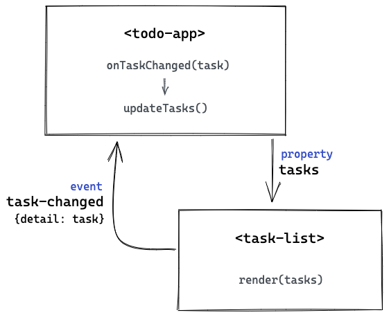

# Sample ToDo App with LitElement

This is an example of a reactive application made with Web Components (LitElement) that follows some of the React recommendations for the application state and communication between components:

- Data flows in only one direction: from parents to children.
- There is one single source of truth for the shared state (tasks states).
- Components act as pure functions that render the same result for the same input (properties).
- Internal state is private.
- User interactions (happenings) and nothing else are notified using events.

## Benefits

### Reduces DOM manipulation

Direct **DOM manipulation or querying is not necessary most of the time** (unless you need to call a method of an element) because the state is set via properties that you can read and write. 

For instance, when the task form is submitted, the input element is not queried to retrieve its value. Same way, the input is not queried to clear it. Instead of that, **we always rely on own properties** (private properties in this case that we can consider state). 


```js
_handleFormSubmit(event) {
  event.preventDefault();

  this.dispatchEvent(
    new CustomEvent('task-added', {
      detail: this._value,
    }),
  );

  this._clearInput();
}

_handleInputChange({ target: input }) {
  this._value = input.value;
}

_clearInput() {
  this._value = '';
}

render() {
  return html`
    <form @submit=${this._handleFormSubmit}>
      <input
        .value=${this._value}
        @input=${this._handleInputChange}
      />
    </form>
  `;
}
```

### One single source of truth for the shared state

When we develop Web Components, it's common to make them self-sufficient, thus giving them the ability to handle its own state. This approach can be ok sometimes but it can be also problematic. React has a recommendation for a common case:

> Often, several components need to reflect the same changing data. We recommend lifting the shared state up to their closest common ancestor. 

This approach has several benefits, like preventing inconsistencies or having stale data, but also prevents violating the parent to children data flow principle.

For instance, the component that renders the task list has the ability to mark tasks as completed. If we considered that component responsible for handling the state of the tasks (changing the `tasks` property by itself), from a parent component we might be tempted to query the modified `tasks` property directly on the component, thus changing the parent to children data flow direction. Instead of that, the component only notifies that a task status has been changed and the parent component is responsible for changing the shared state and passing the updated state back to children.

